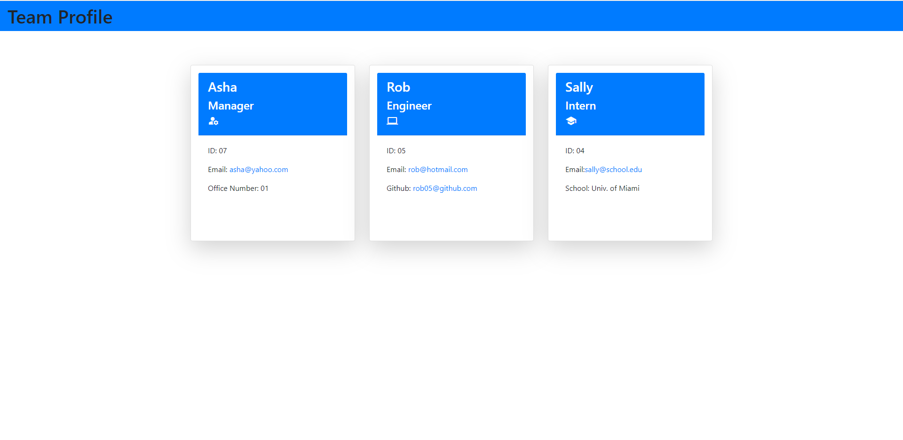

# team-profile-generator

generated team portfolio using object oriented programming

## Table of Contents

-[Description](#Description)

-[Programming Languages, Technologies/Frameworks](#Programming-Languages,-Technologies/Frameworks)

-[Installation](#Installation)

-[Contribution](#Contribution)

-[URL](#URL)

## Description

Built a Node.js command-line application that takes in information about employees on a software engineering team and generates an HTML webpage that displays summaries for each person.

## Programming Languages, Technologies/Frameworks

- Javascript
- HTML
- Node.js
- Jest
- Object Oriented Programming (OOP)

## Installation

1. To run tests `npm run test`
1. Npm i
1. run node index.js
1. Open index.html

## Contribution

true

### Screenshot

### Walkthrough Video

[Tutorial](https://drive.google.com/file/d/1TcPolbosego1NLI8pTq4RBRD0Dm1bC5g/view) 

### URL of the GitHub repository:

<https://github.com/adorsey5/team-profile-generator>
